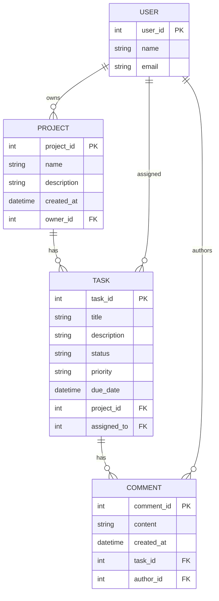
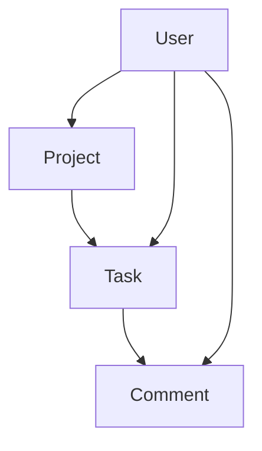

Here’s a polished **README.md** draft for your **User Management System** project. It’s recruiter‑friendly, highlights your architectural choices, and sets up future improvements clearly:

# User Management System

A backend application built with **Spring Boot**, **Spring Data JPA**, and **MySQL** to manage users and their roles.  
This project demonstrates clean architecture, centralized exception handling, and professional API documentation.

---

## 📌 Features
- **Layered Architecture**: Controller, Service, Repository, DTO, Model, Utility, and Exception packages.
- **Persistence**: Integrated Spring Data JPA with MySQL.
- **Error Handling**: Centralized exception management using `@ControllerAdvice` and custom exceptions.
- **RESTful APIs**: Nested endpoints (e.g., `/users/{id}/roles`) for user-role management.
- **API Documentation**: Swagger annotations for clear and interactive API docs.
- **Maintainability**: Lombok used to reduce boilerplate and improve readability.

---
## Entity Diagram

## 🚀 Future Enhancements
- Add **unit and integration tests** with **SonarQube coverage reports**.
- Implement **authentication & authorization** using **Spring Security + JWT**.
- Extend role-based access control for fine-grained permissions.

---

## 🛠️ Technologies Used
- Java  
- Spring Boot  
- Spring Data JPA  
- MySQL  
- Lombok  
- Swagger  

---

## 📂 Project Structure

---

## 📖 API Examples
- **Get User by ID**  
  `GET /users/{id}`  

- **Assign Role to User**  
  `POST /users/{id}/roles`  

---

## 🔗 Repository
[GitHub - User Management System](https://github.com/Sree2011/user_management_system)
